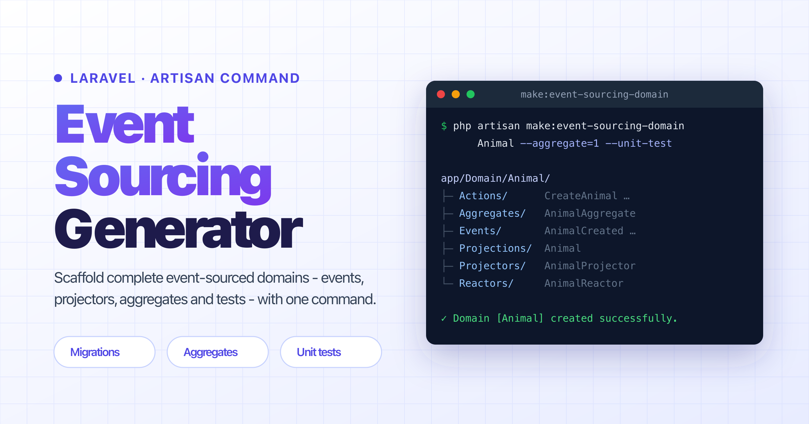
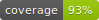

# Laravel event sourcing generator

<picture>
  <source media="(prefers-color-scheme: dark)" srcset="art/cover-dark.png">
  
</picture>


[](https://albertoarena.github.io/laravel-event-sourcing-generator)
[](https://packagist.org/packages/albertoarena/laravel-event-sourcing-generator)
[](https://packagist.org/packages/albertoarena/laravel-event-sourcing-generator)
[](LICENSE.md)


Laravel event sourcing generator scaffolds complete domain structures for [Spatie's Laravel Event Sourcing](https://github.com/spatie/laravel-event-sourcing), providing a single Artisan command to generate events, projections, projectors, aggregates, reactors, actions, DTOs, notifications, and PHPUnit tests — optionally straight from an existing migration.

## 📖 Documentation

**Full documentation is at [albertoarena.github.io/laravel-event-sourcing-generator](https://albertoarena.github.io/laravel-event-sourcing-generator).**

- [Installation](https://albertoarena.github.io/laravel-event-sourcing-generator/getting-started/installation/)
- [Quick start](https://albertoarena.github.io/laravel-event-sourcing-generator/getting-started/quick-start/)
- [Guide](https://albertoarena.github.io/laravel-event-sourcing-generator/guide/basic-usage/) — basic & advanced usage, domains, migrations, unit tests
- [Command options reference](https://albertoarena.github.io/laravel-event-sourcing-generator/reference/command-options/)

## Installation

```shell
composer require albertoarena/laravel-event-sourcing-generator
```

### Compatibility

<!-- BEGIN:compatibility -->

| Laravel | PHP | Testbench |
| --- | --- | --- |
| 11.x (deprecated) | 8.3, 8.4 | 9.x |
| 12.x | 8.3, 8.4, 8.5 | 10.x |
| 13.x | 8.3, 8.4, 8.5 | 11.x |

**PHP:** 8.3 – 8.5 · **Spatie Laravel Event Sourcing:** 7.x

<!-- END:compatibility -->

## Quick start

```shell
php artisan make:event-sourcing-domain Animal --domain=Animal
```

This creates a complete event-sourced domain (events, projections, projectors, actions and DTOs) in `app/Domain/Animal/Animal/`. Add `--aggregate=1`, `--reactor=1`, `--unit-test`, `--notifications=…` and more — see the [documentation](https://albertoarena.github.io/laravel-event-sourcing-generator) for every option and worked examples.

**Using Claude Code?** Install the companion [claude-laravel-event-sourcing](https://github.com/albertoarena/claude-laravel-event-sourcing) skill to scaffold domains conversationally.

## Changelog

Please see [CHANGELOG](CHANGELOG.md) for what has changed recently.

## Contributing

Feel free to fork, improve and create a pull request. Please see [CONTRIBUTING](CONTRIBUTING.md) for details.

## License

The MIT License (MIT). Please see [LICENSE](LICENSE.md) for more information.
