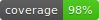

# Laravel event sourcing generator


[](LICENSE.md)


Laravel event sourcing generator adds a new Artisan command that can generate a full domain directory structure
for [Spatie event sourcing](https://github.com/spatie/laravel-event-sourcing).

## Table of Contents

- [Changelog](#changelog)
- [Contributing](#contributing)
- [Installation](#installation)
    - [Compatibility](#compatibility)
    - [Install](#install)
- [Usage](#usage)
    - [Show help](#show-help)
    - [Basic usage](#basic-usage)
    - [Domain and namespace](#domain-and-namespace)
    - [Advanced usage](#advanced-usage)
        - [Set primary key](#set-primary-key)
        - [Generate PHPUnit tests](#generate-phpunit-tests)
        - [Generate aggregates](#generate-aggregates)
        - [Generate reactors](#generate-reactors)
        - [Generate failed events](#generate-failed-events)
        - [Generate notifications](#generate-notifications)
        - [Specify indentation](#specify-indentation)
        - [Specify the path of root folder](#specify-the-path-of-root-folder)
- [Limitations and future enhancements](#limitations-and-future-enhancements)

## Changelog

[⬆️ Go to TOC](#table-of-contents)

Please see [CHANGELOG](CHANGELOG.md) for more information what has changed recently.

## Contributing

[⬆️ Go to TOC](#table-of-contents)

Feel free to fork, improve and create a pull request.

Please see [CONTRIBUTING](CONTRIBUTING.md) for details.

## Installation

[⬆️ Go to TOC](#table-of-contents)

### Compatibility

| What                                                                        | Version         |
|-----------------------------------------------------------------------------|-----------------|
| PHP                                                                         | 8.2 / 8.3       |
| [Laravel](https://github.com/laravel/laravel)                               | 10.x / 11.x (*) |
| [Spatie's event sourcing](https://github.com/spatie/laravel-event-sourcing) | 7.x             |

> (*) Package has been tested in Laravel 10, even it is not officially released for that version.

### Install

```shell
composer require albertoarena/laravel-event-sourcing-generator
```

## Usage

[⬆️ Go to TOC](#table-of-contents)

```text
php artisan make:event-sourcing-domain <model>
  [-d|--domain=<domain>]                           # The name of the domain
  [--namespace=<namespace>]                        # The namespace or root folder (default: "Domain")
  [-m|--migration=<existing_migration>]            # Indicate any existing migration for the model, with or without timestamp prefix. Table name is sufficient
  [--migration-exclude=<excluded_migration>]       # Indicate any existing migration for the model, that must be excluded. It accepts regex. Table name is sufficient
  [-a|--aggregate=<0|1>]                           # Indicate if aggregate must be created or not (accepts 0 or 1)
  [-r|--reactor=<0|1>]                             # Indicate if reactor must be created or not (accepts 0 or 1)
  [-u|--unit-test]                                 # Indicate if PHPUnit tests must be created
  [-p|--primary-key=<uuid|id>]                     # Indicate which is the primary key (uuid, id)
  [--indentation=<indent>]                         # Indentation spaces
  [--failed-events=<0|1>]                          # Indicate if failed events must be created (accepts 0 or 1)
  [--notifications=<database,mail,no,slack,teams>] # Indicate if notifications must be created, comma separated (accepts database,mail,no,slack,teams)
  [--root=<root>                                   # The name of the root folder (default: "app")
```

### Show help

```shell
php artisan help make:event-sourcing-domain
```

### Basic usage

[⬆️ Go to TOC](#table-of-contents)

[Documentation about basic usage](./docs/basic-usage.md)

#### Generate a model with same name of the domain

```shell
php artisan make:event-sourcing-domain Animal \
  --domain=Animal
```

#### Generate a model with different domain

[Read documentation with examples](./docs/domain-and-namespace.md#choosing-the-name-of-the-domain)

```shell
php artisan make:event-sourcing-domain Tiger \
  --domain=Animal
```

#### Generate a model with different domain and namespace

[Read documentation with examples](./docs/domain-and-namespace.md#choosing-the-namespace)

```shell
php artisan make:event-sourcing-domain Tiger \
  --domain=Animal \
  --namespace=CustomDomain 
```

#### Generate a model from existing migration

[Read documentation with examples](./docs/migrations.md)

```shell
php artisan make:event-sourcing-domain Animal \
  --migration=create_animal_table \
  --unit-test
```

#### Generate a model from existing migration using pattern and exclude specific one

[Read documentation with examples](./docs/migrations.md#generate-a-domain-using-update-migration-excluding-some-specific-migration)

```shell
php artisan make:event-sourcing-domain Animal \
  --migration=animal \
  --migration-exclude=drop_last_column_from_animals \
  --unit-test
```

#### Generate a model from existing migration using pattern and exclude using regex

[Read documentation with examples](./docs/migrations.md#generate-a-domain-using-update-migration-excluding-some-specific-migration)

```shell
php artisan make:event-sourcing-domain Animal \
  --migration=animal \
  --migration-exclude="/drop_.*_from_animals/" \
  --unit-test
```

#### Generate a model from existing migration with PHPUnit tests

```shell
php artisan make:event-sourcing-domain Animal \
  --migration=create_animal_table \
  --unit-test
```

#### Generate a model from existing migration with failed events and database / mail / Slack notifications

```shell
php artisan make:event-sourcing-domain Animal \
  --migration=create_animal_table \
  --failed-events=1 \
  --notifications=database,mail,slack
```

### Domain and namespace

[⬆️ Go to TOC](#table-of-contents)

[Read documentation about directory structure](./docs/domain-and-namespace.md#directory-structure)

#### Specify the name of the domain

[Read documentation with examples](./docs/domain-and-namespace.md#specify-the-name-of-the-domain)

```shell
php artisan make:event-sourcing-domain Animal --domain=Tiger
php artisan make:event-sourcing-domain Animal --domain=Lion
```

#### Specify the namespace

[Read documentation with examples](./docs/domain-and-namespace.md#specify-the-namespace)

```shell
php artisan make:event-sourcing-domain Tiger --namespace=MyDomain --domain=Animal
```

### Advanced usage

[⬆️ Go to TOC](#table-of-contents)

#### Set primary key

[Read documentation with examples](./docs/advanced-usage.md#specify-primary-key)

Default primary key is `uuid`. That will work with Aggregate class.

It is possible to use `id` as primary key:

```shell
php artisan make:event-sourcing-domain Animal --primary-key=id
```

When importing migrations, primary key will be automatically loaded from file.

#### Generate PHPUnit tests

[Read documentation with examples](./docs/unit-tests.md)

```shell
php artisan make:event-sourcing-domain Animal --unit-test
```

#### Generate aggregates

[Read documentation with examples](./docs/advanced-usage.md#generate-aggregates)

```shell
php artisan make:event-sourcing-domain Animal --aggregate=1
```

This is available only for models using `uuid` as primary key.

#### Generate reactors

[Read documentation with examples](./docs/advanced-usage.md#generate-reactors)

```shell
php artisan make:event-sourcing-domain Animal --reactor=1
```

#### Generate failed events

[Read documentation with examples](./docs/advanced-usage.md#generate-failed-events)

```shell
php artisan make:event-sourcing-domain Animal --failed-events=1
```

#### Generate notifications

[Read documentation with examples](./docs/advanced-usage.md#generate-notifications)

```shell
php artisan make:event-sourcing-domain Animal --notifications=<NOTIFICATIONS>
```

#### Specify indentation

[Read documentation with examples](./docs/advanced-usage.md#specify-the-indentation)

```shell
php artisan make:event-sourcing-domain Animal --indentation=2
```

#### Specify the path of root folder

[Read documentation with examples](./docs/advanced-usage.md#specify-the-path-of-root-folder)

```shell
php artisan make:event-sourcing-domain Animal --root=src
```

## Limitations and future enhancements

[⬆️ Go to TOC](#table-of-contents)

### Blueprint column types

[Read documentation](./docs/migrations.md#unsupported-column-types)
